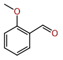
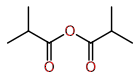

## 05_C5H12O

| Exercise | Correction |
|----------|------------|
| 01 |  |
| 02 |  |
| 03 |  |
| 04 |  |

## 07_C5H11Cl

| Exercise | Correction |
|----------|------------|
| 01 |  |
| 02 |  |
| 03 |  |
| 05 |  |

## 10_C4H8O

| Exercise | Correction |
|----------|------------|
| 01 |  |
| 02 |  |
| 03 |  |
| 04 |  |
| 05 |  |
| 06 |  |
| 07 |  |

## 20_C5H10O

| Exercise | Correction |
|----------|------------|
| 01 |  |
| 02 |  |
| 05 |  |
| 07 |  |
| 09 |  |
| 10 |  |
| 11 |  |
| 12 |  |
| 14 |  |
| 16 |  |
| 17 |  |
| 18 |  |
| 19 |  |

## 30_C5H8O

| Exercise | Correction |
|----------|------------|
| 01 |  |
| 02 |  |
| 03 |  |
| 04 |  |
| 05 |  |
| 06 |  |
| 07 |  |
| 08 |  |
| 09 |  |
| 10 |  |
| 11 |  |
| 12 |  |
| 13 |  |
| 14 |  |

## 40_C6H12O2

| Exercise | Correction |
|----------|------------|
| 01 |  |
| 02 |  |
| 03 |  |
| 04 |  |
| 06 |  |
| 08 |  |
| 09 |  |
| 10 |  |
| 11 |  |
| 12 |  |
| 13 |  |

## 50_C6H13NO_Amides

| Exercise | Correction |
|----------|------------|
| 01 |  |
| 02 |  |
| 03 |  |
| 04 |  |
| 05 |  |
| 06 |  |

## 60_C9H12O_Aromatic

| Exercise | Correction |
|----------|------------|
| 02 |  |
| 05 |  |
| 09 |  |
| 10 |  |
| 11 |  |
| 13 |  |
| 14 |  |
| 16 |  |

## 90_Mixed

| Exercise | Correction |
|----------|------------|
| 01 |  |
| 02 |  |
| 03 |  |
| 04 |  |
| 05 |  |
| 07 |  |
| 08 |  |
| 09 |  |
| 10 |  |
| 11 |  |
| 12 |  |
| 13 |  |
| 14 |  |
| 15 |  |
| 16 |  |